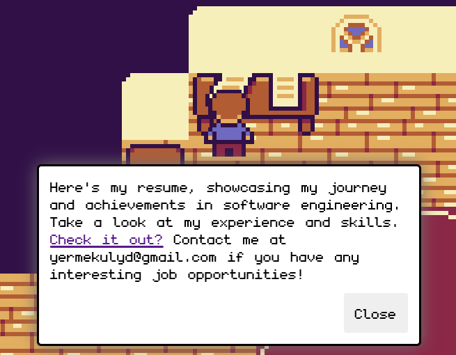

# My 2D Developer Portfolio Game

Welcome to my unique 2D portfolio! Inspired by creative ways to showcase developer skills, I decided to build something different—a 2D game that represents my journey and achievements as a developer. This project is fully responsive and works seamlessly on both desktop and mobile devices.

## About This Project
This project is built using [Kaboom.js](https://kaboomjs.com/), a library for making games in JavaScript. It’s a personal representation of my skills, experience, and hobbies, all encapsulated in a fun and interactive way. Each element within the game is linked to a part of my professional journey.

## Acknowledgments
- Special thanks to [Momen Games](https://momen-games.itch.io/happy-la-v2-ts) for the original tileset that I’ve modified to fit the theme of this portfolio.

# How to run

Note: You need `Node.js` and `npm` installed on your machine.

`npm install` then `npm run dev`

# How to build

`npm run build` and a dist folder should be created.

# How to preview the build

`npm run preview`